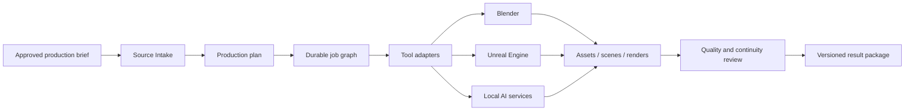

Forge Studio

**A local-first production control plane for high-fidelity 3D animation and cinematic realism.**

Forge Studio is the production application of the Kynolith ecosystem. It is being built to turn
approved creative briefs into traceable characters, environments, scenes, animation, sound,
lighting, renders, and delivery packages across professional digital-content tools.

Forge does not attempt to replace Blender, Unreal Engine, or specialist AI and audio tools. It
coordinates them through explicit adapters, versioned jobs, visible state, and review gates.

> **Project status:** Foundation alpha. The standalone desktop shell, control API, persistence,
> capability discovery, verified import boundary, and local operations foundation are implemented.
> Production departments and DCC execution adapters are under active development.

## Product principles

- **Local first:** production assets and tools remain on infrastructure controlled by the studio.
- **Tool neutral:** Blender, Unreal Engine, and future providers connect through explicit adapters.
- **Traceable:** every asset, shot, job, review, and render is versioned and attributable.
- **Resumable:** long-running production work is modeled as durable jobs rather than UI actions.
- **Review driven:** automated results remain proposals until they pass defined quality gates.
- **Independent:** Forge can operate without unrestricted access to the Kynolith Core database.
- **Realism focused:** anatomy, materials, motion, lighting, sound, and continuity are evaluated as
  separate production disciplines.

## Operational today

- Standalone Tauri desktop application shell
- Dark Svelte/TypeScript studio interface foundation
- Local FastAPI control service
- SQLite persistence with Alembic migrations
- Background-worker shell and durable job schema foundation
- Read-only source boundary with verified SHA-256 imports
- Local capability discovery for Blender and Unreal Engine
- Adapter configuration points for ComfyUI, TRELLIS, and Audio2Face-compatible services
- Structured logging and local health reporting
- Filesystem authority rules separating source archives, Forge work, and shared exchange data
- Automated API, import, and path-policy tests

AI and external production providers are disabled until they are explicitly configured and pass
capability, privacy, and reproducibility checks.

## Planned production departments

| Department | Responsibility |
|---|---|
| Source Intake | Validate production briefs, references, constraints, and rights metadata |
| Production Planner | Break briefs into assets, sequences, scenes, shots, and dependencies |
| Character | Anatomy, topology, rigging, grooming, clothing, expression, and identity |
| Environment | Sets, terrain, architecture, vegetation, props, atmosphere, and scale |
| Asset Foundry | Versioned modeling, materials, optimization, validation, and reuse |
| Scene and Shot | Layout, cameras, blocking, continuity, and shot assembly |
| Animation | Body, face, cloth, hair, creatures, crowds, and simulation |
| Soundstage | Dialogue, performance, effects, ambience, music, and mix provenance |
| Look Development | Materials, lighting, color, lenses, atmosphere, and realism review |
| Render and Delivery | Render queues, quality control, packaging, manifests, and handoff |

## Architecture



| Layer | Technology | Responsibility |
|---|---|---|
| Desktop | Tauri 2, Rust | Secure native shell and process boundary |
| Interface | Svelte 5, TypeScript, Vite | Studio workbench and production state |
| Control API | FastAPI, Python 3.12 | Jobs, projects, adapters, imports, and operations |
| Persistence | SQLite, SQLAlchemy, Alembic | Local authoritative production control data |
| Adapters | Explicit local integrations | DCC, generation, animation, and audio capabilities |
| Operations | Worker processes and structured logs | Durable execution and diagnostics |

## Repository structure

```text
Forge-Studio/
├── app/
│   ├── api/
│   │   ├── forge_api/      # FastAPI control service
│   │   └── migrations/     # Alembic migrations
│   └── desktop/
│       ├── src/            # Svelte/TypeScript interface
│       └── src-tauri/      # Rust/Tauri native shell
├── config/                 # Safe defaults and adapter definitions
├── docs/                   # Architecture, contracts, and runbooks
├── scripts/                # Local build and operations tooling
├── tests/                  # API, import, and safety tests
├── pyproject.toml
└── README.md
```

Private assets, source manuscripts, project databases, renders, tool installations, credentials,
and local provider outputs are not part of the public repository.

## Development setup

### Requirements

- Python 3.12
- Node.js 24 and pnpm
- Rust stable toolchain
- Tauri 2 platform prerequisites
- Windows PowerShell for the current local operations scripts

### Control service

```powershell
python -m venv .venv
.\.venv\Scripts\Activate.ps1
python -m pip install --upgrade pip
python -m pip install -e ".[dev]"
Copy-Item .env.example .env.local
python -m alembic upgrade head
python -m uvicorn forge_api.main:app --host 127.0.0.1 --port 8100
```

### Desktop client

```powershell
Set-Location app/desktop
pnpm install --frozen-lockfile
pnpm check
pnpm build
pnpm tauri dev
```

### Verification

```powershell
.\.venv\Scripts\ruff.exe format --check app tests
.\.venv\Scripts\ruff.exe check app tests
.\.venv\Scripts\pytest.exe
```

## Roadmap

- **Phase 0:** Standalone shell, control API, persistence, worker, and archive firewall
- **Phase 1:** Production control plane, projects, job graphs, review state, and operations UI
- **Phase 2:** Blender asset pipeline and deterministic asset validation
- **Phase 3:** Unreal Engine scene, sequencing, camera, and render integration
- **Phase 4:** Character production, rigging, grooming, and identity continuity
- **Phase 5:** Environment, scene, shot, animation, lighting, and render workflows
- **Phase 6:** Local AI adapters and the realism evaluation workbench
- **Phase 7:** Soundstage, performance, mix, packaging, and final delivery
- **Phase 8:** Versioned production exchange with Kynolith Core

## Relationship to Kynolith Core

[Kynolith Core](https://github.com/DawGroomer/Kynolith-Core) owns source knowledge, canon,
classifications, approvals, citations, and frozen source snapshots. Forge Studio owns production
planning and execution.

Core sends a versioned production brief package. Forge returns a versioned result package with
manifests, provenance, review state, and output hashes. Canon does not evolve merely because a
render or generated asset exists; acceptance remains an explicit Core decision.

## Security and safety

- The control API binds to loopback by default.
- Source archives are treated as read-only inputs.
- Imports are copied and hash verified before use.
- Tool executables and service endpoints require explicit configuration.
- DCC and AI adapters receive only the files and parameters required for their job.
- Credentials, production assets, runtime databases, and rendered output remain outside Git.
- Unsigned installers should be treated as development builds until release signing is enabled.

Do not report security vulnerabilities through a public issue. Use the private security contact
published by Kynolith LLC when the external security policy becomes available.

## Contributing

The supported implementation is currently developed privately by Kynolith LLC. Public issues and
contributions will open after stable adapter contracts, reproducible fixtures, the security policy,
and contributor licensing are published.

## License

Copyright © Kynolith LLC. All rights reserved.

No open-source license is granted unless a `LICENSE` file is added to the public repository.
